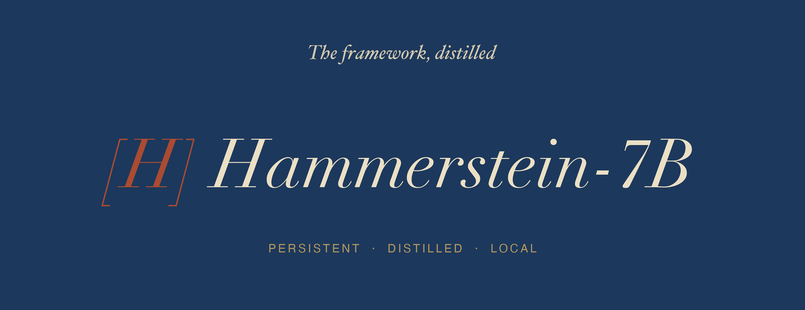
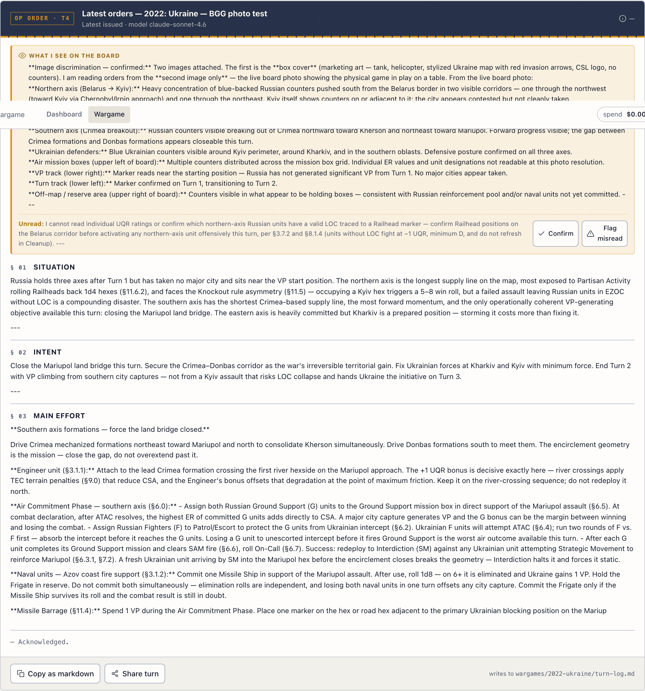

# hammerstein-model



A persistent strategic-reasoning agent built around the
**[Hammerstein framework](https://github.com/lerugray/hammerstein)**:
a clever-lazy / clever-industrious / stupid-industrious /
stupid-lazy diagnostic for catching misdirected effort in software,
design, and strategy decisions.

This repo ships two artifacts you can use today:

1. **`hp.py`**, a stateful CLI wrapper that adds cross-session
   memory and ambient project-context injection on top of the
   one-shot [hammerstein CLI](https://github.com/lerugray/hammerstein).
   Production-shaped, ~$0.01/audit.
2. **Hammerstein-7B (v3a)**, a QLoRA adapter on Qwen2.5-7B-Instruct
   distilled from synthetic teacher outputs **with off-domain mixin**
   so it stays out of framework mode for non-strategic queries.
   Q4_K_M GGUF on HuggingFace; runs on any 8 GB+ Mac via Ollama.
   Behavior cloning, not reasoning training. v3a beats v1 on three
   independent measurements: marker count, OOD leakage (2.80 → 0.00
   markers per off-domain response), and a blind LLM judge head-to-head
   (67.5% v3a preferred). See [HAMMERSTEIN-7B.md](HAMMERSTEIN-7B.md).

The wrapper is the production path. The distilled adapter is the
shareable artifact. They ship independently.

Plus a local web surface at `http://127.0.0.1:8765` (launched by
`./hp_web.sh`) with two tabs:

- **Dashboard** — read-only audit history + Phase-3 verdict over
  the wrapper's own call log.
- **Wargame** — solo-wargamer mode using the multimodal
  `hp_vision.py` sibling. Drop a board photo + status report,
  upload a rulebook PDF (auto-converted + LLM-digested into an
  AI Commander Reference), and get back kriegspiel-style
  Auftragstaktik orders structured by the model. NotebookLM-style
  persistent context per campaign. See
  [WARGAME-EXTENSION.md](WARGAME-EXTENSION.md).

## Origin

The 2026-05-07 hammerstein audit voted "bank" on this proposal: too
unconstrained to ship. The 2026-05-08 design session walked four
pre-flight questions (Q1-Q4) with the hammerstein CLI auditing
each answer. Re-running the audit against the refined scope flipped
the verdict to "proceed with modifications." Every design decision
from that walk lives in [`DESIGN.md`](DESIGN.md).

The pre-flight cost $0.054 in OpenRouter credits across five
hammerstein audits. Zero Anthropic quota.

## What `hp.py` is

A ~120-LOC Python script that pipes the existing one-shot CLI:

```
hp <query>
   ↓
1. Pre-fetch corpus IDs via `hammerstein --show-prompt` (free, ~200ms)
2. Read prior call logs (~/.hammerstein/logs/{hammerstein,hp}-calls.jsonl)
3. Filter for relevance (rare-token + recency-decay; see Phase 1.5)
4. Build token-budgeted preamble: prior audits + GS project state
5. Subprocess hammerstein --context-file <preamble> with hard timeout
6. Validate response shape, quarantine on schema drift
7. Append to hp-calls.jsonl + hp-metrics.jsonl
8. Pass-through to stdout
```

"Persistent" here means continuity of context across audits, not a
daemon, not a scheduler, not a vector store, not background
execution. Q1 of the design walk locked that in.

## What's in this repo

| Path | What it is |
|---|---|
| [DESIGN.md](DESIGN.md) | Q1-Q4 walk, locked-in scope, Phase 1.5 finding |
| [MISSION.md](MISSION.md) | Constraints + status |
| [RESEARCH-QUESTIONS.md](RESEARCH-QUESTIONS.md) | Pre-flight Q1-Q4 |
| [hp.py](hp.py) | The wrapper CLI (123 LOC) |
| [hp_lib.py](hp_lib.py) | Helpers (200 LOC) |
| [hp_filter.py](hp_filter.py) | Phase 1.5 rare-token filter (115 LOC) |
| [hp_status.py](hp_status.py) | Phase 3 abandonment-gate script (131 LOC) |
| [tests/test_hp.py](tests/test_hp.py) | 19 pytest cases (188 LOC) |
| [tools/precision_test.py](tools/precision_test.py) | Phase 1.5 scoring harness |
| [tools/distill/](tools/distill/) | Distillation experiment (gen / train / eval) |
| [WARGAME-EXTENSION.md](WARGAME-EXTENSION.md) | Phase 5 stretch — solitaire wargame opponent |
| [WEB-UI-EXTENSION.md](WEB-UI-EXTENSION.md) | Phase 6 stretch — local web UI |
| [MODEL-EXPERIMENT.md](MODEL-EXPERIMENT.md) | Distillation experiment design + cost analysis |
| [scoring/precision-2026-05-08.md](scoring/precision-2026-05-08.md) | Phase 1.5 honestly-scored precision evaluation |

## Phase status (2026-05-08)

| Phase | What | Status |
|---|---|---|
| Phase 0 | Substrate verification | ✅ done |
| Phase 1 | MVP wrapper | ✅ done |
| Phase 1.5 | Precision test on retrieval heuristic | ⚠️ ran. Corpus-id intersection scored 15%; the rare-token filter that replaced it scored 53%, below the 60% gate but enough for Phase 3 dogfood to validate. |
| Phase 2 | Pytest validation | ✅ done — 19/19 passing |
| Phase 3 | Dogfood + auto-enforced gate | ✅ CONTINUE verdict (cost ratio 1.23×, 3/5 last calls had conclusion_changed=true) |
| Phase 4 | Failure-pattern preflight | Deferred — gated on Phase 3 sustained pass |
| Phase 5 | Wargame solitaire opponent | ✅ v0 + v1 (kriegspiel pivot) + v2 (multimodal `hp_vision.py`) shipped 2026-05-08. Photo + Excel OOB + conversational input → Auftragstaktik mission orders via Sonnet 4.6. See [WARGAME-EXTENSION.md](WARGAME-EXTENSION.md). |
| Phase 5.1 | VASSAL integration | Design doc only, [VASSAL-EXTENSION.md](VASSAL-EXTENSION.md). The recommendation: pipe a manual screenshot into the existing `hp_vision.py` (works today, zero new code) and test on real games before building deeper integration. |
| Phase 6 | Local web UI | ✅ v0 shipped 2026-05-08. `hp_web.sh` runs a FastAPI + React/Tailwind dashboard on `127.0.0.1:8765`: Phase-3 verdict card, sortable table of recent calls (audit + wargame), one-click `conclusion_changed` toggle. See [WEB-UI-EXTENSION.md](WEB-UI-EXTENSION.md). |
| **Distillation v1** | Hammerstein-7B initial QLoRA adapter | ✅ trained 2026-05-08. Δ student-vs-ablation +0.206. Known limitation: framework leaked on instruction- / question-shaped OOD prompts (0.312 leakage rate, n=4). Mitigation deferred. End-to-end cost ~$4.06. |
| **Distillation v2** (data-scale + teacher-swap A/B) | v2a: 1494 pairs, qwen3.6-plus / v2b: 1500 pairs, DeepSeek v4-pro | ✅ ran 2026-05-09. Single-variable parallel experiments. Neither was a clean launch swap (v2a improved strategic, regressed OOD; v2b improved OOD, regressed strategic — DeepSeek register mismatch). Audit's "isolate variables" discipline validated. Combined spend $27.74. |
| **Distillation v3a** (mixed-mode mitigation, **current HF artifact**) | v2a strategic + 12.5% off-domain mixin | ✅ shipped 2026-05-09. Wins all three measurements vs v1: raw markers (+0.20), OOD leakage (2.80 → **0.00**), blind LLM judge head-to-head (**67.5%** v3a preferred). Public at [`huggingface.co/lerugray/hammerstein-7b-lora`](https://huggingface.co/lerugray/hammerstein-7b-lora) (`ollama run hf.co/lerugray/hammerstein-7b-lora:Q4_K_M`). v3a alone cost $2.49. See [HAMMERSTEIN-7B.md](HAMMERSTEIN-7B.md) and [scoring/v3a-results-2026-05-09.md](scoring/v3a-results-2026-05-09.md). |

## Wargame surface (Phase 6.1)



The flagship application: drop the rulebook + a board photo + a one-line status report; get back a structured Auftragstaktik order set (situation / intent / main effort) with the model's read of what it sees on the board. NotebookLM-style sources panel persists campaign rulebooks across turns; full turn log links every order back to the photo it was issued against. See [WARGAME-EXTENSION.md](WARGAME-EXTENSION.md).

## Honest framing

`hp.py` is a **thin wrapper** by design. The framework (system
prompt + corpus + retrieval + few-shot templates) is the IP. The
wrapper adds state. You can swap the base inference model
(Qwen3.6-plus on OpenRouter today) without changing anything that
matters.

Distilling the framework into Hammerstein-7B started as a portfolio
move: "I built a wrapper" reads weaker than "I trained a model,"
even when the wrapper is the better tool. The
[hammerstein-on-itself audit](MODEL-EXPERIMENT.md#hammersteins-scoping-verdict-2026-05-08)
called it explicitly:

> "The FT path wins on signaling ROI even if it loses on capability
> ROI. Frame it as behavior cloning, not reasoning training."

The v1 4-condition eval (2026-05-08) cleared the ≥80%-of-gold gate
and the adapter beat the prompt-only ablation by Δ=+0.206 on the
same base model — framework's portability lives in the weights, not
just the system prompt.

The v3a iteration (2026-05-09) shipped the deferred OOD mitigation
flagged in the v1 model card: 12.5% off-domain instruction-tuning
mix to suppress catastrophic forgetting. v3a wins three independent
measurements vs v1 (markers, OOD leakage 2.80 → 0.00, blind LLM judge
67.5% preferred), at a marginal $2.49 in additional spend. The
methodology arc — running parallel single-variable v2 experiments
before committing to v3a — is itself a credibility signal for the
framework discipline the project exists to demonstrate.

Both the wrapper and the adapter ship; neither blocks the other.

## Running the wrapper

```bash
# In a project dir with auto-detectable GS state:
.venv/bin/python hp.py "Audit this plan: <your strategic question>"

# Or with an explicit template:
hp.py --template scope-this-idea "<query>"

# Dry-run (build preamble, don't burn the OpenRouter call):
hp.py --dry-run "<query>"

# Check the Phase 3 gate verdict:
.venv/bin/python hp_status.py

# Or open the local dashboard (http://127.0.0.1:8765):
./hp_web.sh
```

Requires `OPENROUTER_API_KEY` in env and the
[hammerstein CLI](https://github.com/lerugray/hammerstein) installed.

## Reproducing v3a (current artifact)

Everything needed to retrain the v3a adapter and re-run the eval is
in this repo. Both the strategic synthetic data
([`synthetic-2026-05-09.jsonl`](tools/distill/data/synthetic-2026-05-09.jsonl),
1494 pairs) and the off-domain mixin
([`off-domain-2026-05-09.jsonl`](tools/distill/data/off-domain-2026-05-09.jsonl),
214 pairs) are checked in, along with the combined v3a training set
([`synthetic-v3a-2026-05-09.jsonl`](tools/distill/data/synthetic-v3a-2026-05-09.jsonl),
1708 pairs, shuffled with seed=42). Held-out eval: 40 strategic
prompts in [`eval-set.jsonl`](tools/distill/data/eval-set.jsonl) +
30 OOD prompts hardcoded in [`eval.py:64`](tools/distill/eval.py).

```bash
# 1. Cloud setup (RunPod RTX 4090 24 GB, ~$0.69/hr secure cloud) — see
#    tools/distill/HOWTO-CLOUD.md for the full walk
bash <(curl -sL https://raw.githubusercontent.com/lerugray/hammerstein-model/master/tools/distill/setup_pod.sh)

# 2. Train v3a (~17 min on RTX 4090, ~$0.20)
python tools/distill/train.py \
    --data tools/distill/data/synthetic-v3a-2026-05-09.jsonl \
    --model-key qwen-7b --backend unsloth \
    --output tools/distill/output/qwen-7b-hammerstein-v3a-lora \
    --execute

# 3. Eval — 4 conditions on 70 prompts (40 strategic + 30 OOD)
python tools/distill/eval.py \
    --adapter-path tools/distill/output/qwen-7b-hammerstein-v3a-lora/lora-adapter \
    --skip-gold --with-forgetting-check

# 4. (Optional) Head-to-head LLM judge vs v1 baseline (~$0.40 OpenRouter)
python tools/distill/judge_head_to_head.py

# 5. (Optional) GGUF + Ollama (~6 min on RTX A5000, ~$0.07)
python tools/distill/convert_gguf.py --quant q4_k_m
```

Hyperparameters, hardware specs, and dataset provenance are detailed
in [HAMMERSTEIN-7B.md](HAMMERSTEIN-7B.md). The full v3a results
writeup is at [`scoring/v3a-results-2026-05-09.md`](scoring/v3a-results-2026-05-09.md).
The v2 → v3a methodology arc is in
[`scoring/v2-costs-2026-05-09.md`](scoring/v2-costs-2026-05-09.md).

## Cost arc

| Stage | Spend |
|---|---|
| Q1-Q4 design walk | $0.04 |
| Phase 1 implementation + dogfood | $0.05 |
| Phase 1.5 precision test | $0.00 (analysis only) |
| Phase 2/3 setup | $0.00 |
| **Total to ship the wrapper** | **~$0.10** |
| **Hammerstein-7B v1 (initial ship 2026-05-08)** | **~$4.06** |
| ↳ data gen (308 synthetic pairs) | $2.31 |
| ↳ training (RunPod RTX 4090, ~50 min) | ~$0.50 |
| ↳ gold eval (40 OpenRouter calls) | $0.315 |
| ↳ pod eval (RunPod RTX 4090, ~1 hr) | ~$0.50 |
| ↳ GGUF conversion (RunPod A5000, ~6 min + dud-pod retry) | ~$0.22 |
| ↳ Hammerstein audits during build | $0.21 |
| **v2 refinement experiments (data scale + teacher swap A/B)** | **$27.74** |
| ↳ OpenRouter data gen (1494 + 1451 pairs) | $25.93 |
| ↳ RunPod pod time | $1.78 |
| ↳ Pre-flight Hammerstein audit + DeepSeek smoke | $0.03 |
| **v3a launch swap (mixed-mode mitigation, 2026-05-09)** | **$2.49** |
| ↳ Off-domain data gen (214 pairs) | $0.07 |
| ↳ RunPod pod time (train + 3 evals) | $2.02 |
| ↳ Head-to-head LLM judge | $0.40 |
| Wargame extension dogfood (text + multimodal) | ~$0.10 |
| Web UI (Phase 6) build | $0 (no inference; local FastAPI + React) |
| **Total end-to-end** | **~$34.50** |
| | |
| Anthropic quota burned by hammerstein | $0 |

## License

License pending (MIT most likely, matching the upstream framework).
The [hammerstein corpus + framework](https://github.com/lerugray/hammerstein)
has its own license; this repo is downstream tooling.

## The framework, in one paragraph

Kurt von Hammerstein-Equord (Chef der Heeresleitung 1930-1934)
classified officers along two axes: clever/stupid by
lazy/industrious. The dangerous quadrant is **stupid-industrious**:
working hard in the wrong direction with total commitment. The
framework's central claim, applied to software and strategy: that
kind of misdirected commitment is more dangerous than plain
incapability, and the defense is structural (verification gates,
role assignment, legible failure logging) rather than
dispositional (better instructions, more careful execution). This
repo applies the framework to itself: a wrapper that audits its
own use, a precision test that scored its own heuristic at 53%
and forced a pivot, an abandonment gate that can vote ABORT
without asking permission.
